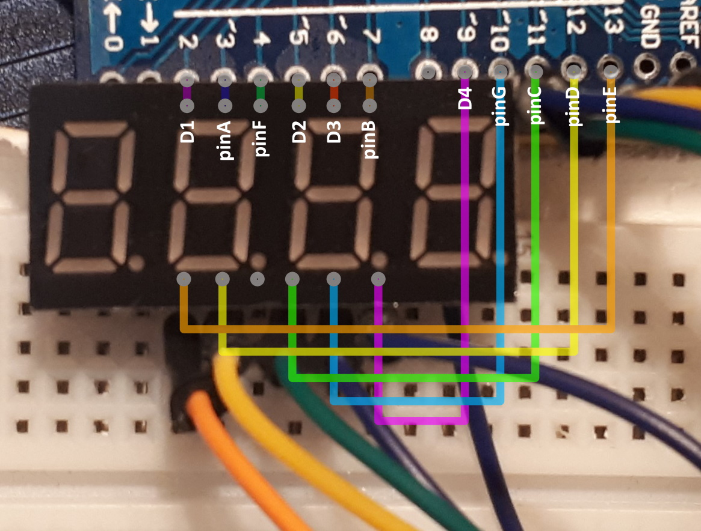

# Arduino - 4 Digit 7 Segment LED Display

## Equipment
- Arduino Board 
- 4 Digit 7 Segment LED Display

## Instructions
1) Setup your arduino and display like the diagram above (the third pin from the bottom left is not used in this example).
2) Compile and upload to arduino.

## Functions
- BootTest()
- PingPongOnce(KEY keys[6], int delayTime)
- PingPongLoop(KEY keys[6], int delayTime)
- DisplayKey(KEYS key, SEGMENT_POSITIONS position, int delayTime);

## Functions Overview
- BootTest - Runs a series of visual tests for each segment piece on the display.
- PingPongOnce - Runs a ping-pong visual forward and back, ending on the first digit of the display. (Used when called once)
- PingPongLoop - Runs a ping-pong visual forward and back, ending on the second digit of the display. (Used inside a loop)
- DisplayKey - Displays a character in a chosen digit position of the display with delay.